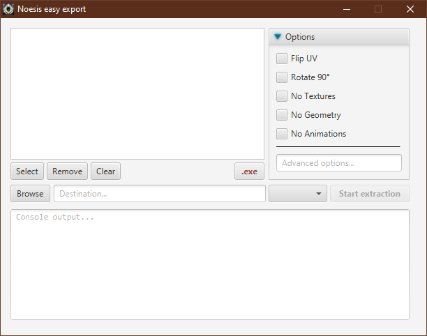
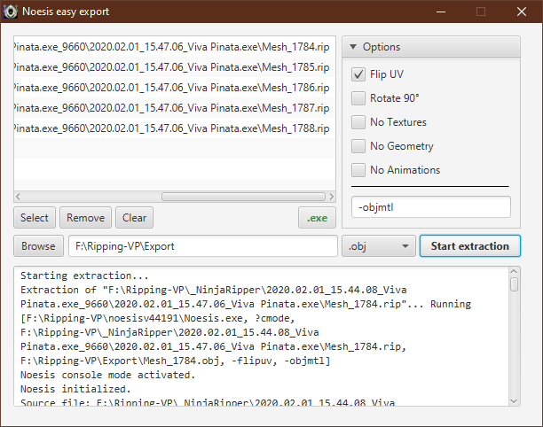

# NoesisEasyExport
A GUI tool to make Noesis file export much easier.

## Requirements
You **must** have downloaded and installed [Noesis](http://www.richwhitehouse.com/index.php?content=inc_projects.php&showproject=91).

NoesisEasyExport requires Java to run. It has been built on Java 8, but up to Java 13 should work fine, as long as you have installed the JavaFX runtime.

## How to run it?
You should be able to double-click on the .jar file to run the program. Otherwise, run `java -jar NoesisEasyExport.jar` into a console to start the app.

## GUI showcase

As you can see, almost every feature of Noesis is present here.

To be able to start the process, you must have chosen:
1. the .exe file of Noesis (".exe" button)
2. a destination folder ("Browse" and text box)
3. at least one file to extract (list view and "Select", "Remove", "Clear" buttons)
4. a file extension (choice box next to the "Start extraction" button)

Here is what is looks like when used:

